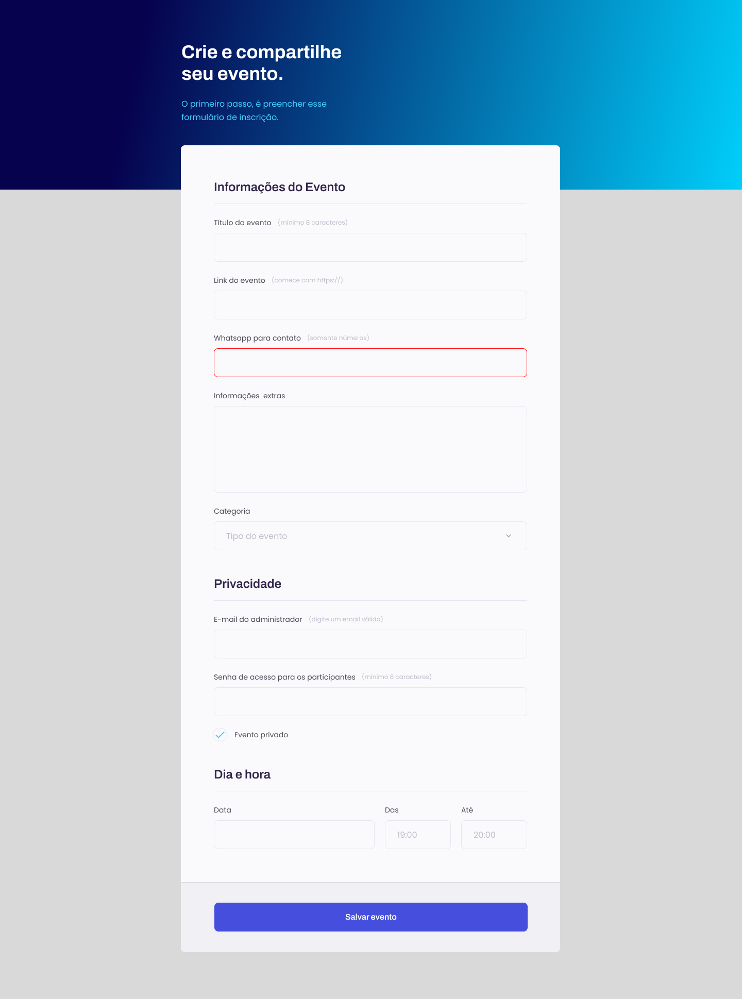

<h1 align="center"> Formulário para eventos </h1>

Este Formulário foi criado como projeto de ensino de tecnologias WEB.  

  <a href="#-tecnologias">Tecnologias</a>&nbsp;&nbsp;&nbsp;|&nbsp;&nbsp;&nbsp;
  <a href="#-projeto">Projeto</a>&nbsp;&nbsp;&nbsp;|&nbsp;&nbsp;&nbsp;
  <a href="#-layout">Layout</a>&nbsp;&nbsp;&nbsp;|&nbsp;&nbsp;&nbsp;
  <a href="#memo-licença">Licença</a>f

  

 

  

## 🚀 Tecnologias

Esse projeto foi desenvolvido com as seguintes tecnologias:

- HTML e CSS
- Git e Github
- Figma

## 💻 Projeto

Este formulário servirá como parte do processo da criação, divulgação ou orçamento de um evento, utilizando um site web.

- [Visite o projeto online](https://alexsandro-oliveria.github.io/form-event)

## 🔖 Layout

Você pode visualizar o layout do projeto através [DESSE LINK](https://www.figma.com/file/Rg9wcVTr80pReVf9P5U3ci/Explorer-Stage-03-Projeto-01-(Copy)?t=U2ou8orXsqw4zNS3-1). É necessário ter conta no [Figma](https://figma.com) para acessá-lo.

## :memo: Licença

Esse projeto está sob a licença MIT.

---

Developed with ♥ by Alexs :wave: